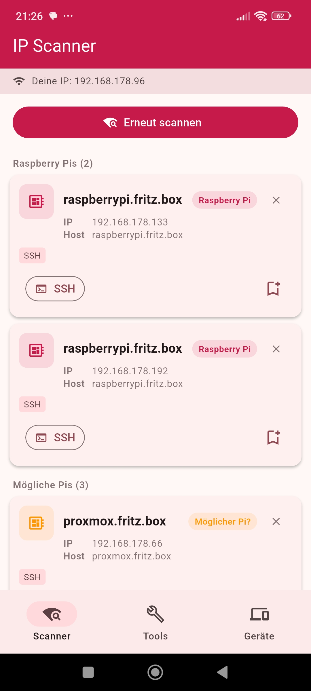
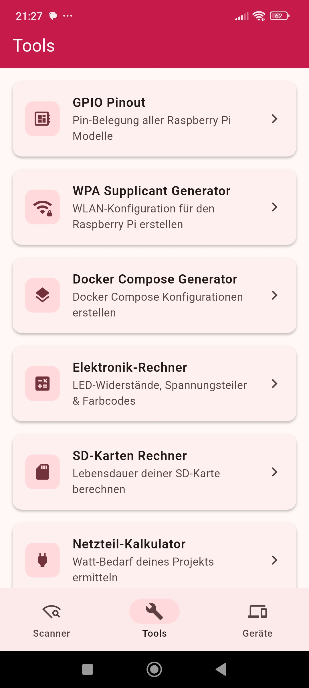
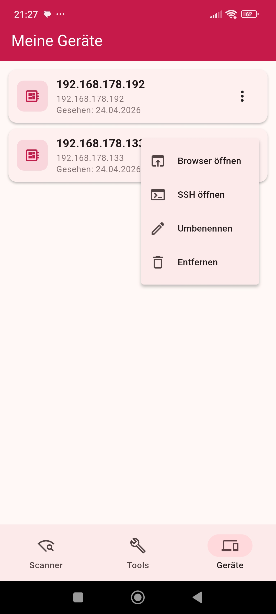

# raspberry.tips App

Android App zum Auffinden von Raspberry Pis im Heimnetz – plus alle Tools von [raspberry.tips](https://raspberry.tips) direkt in der App.

## Screenshots

<p align="center">
  
  
  
</p>

## Features

- **IP Scanner** – Findet Raspberry Pis automatisch per mDNS, MAC-Adress-Erkennung und Port-Scan
- **Geräte speichern** – Gefundene Pis speichern, umbenennen und per SSH oder Browser schnell erreichen
- **Tools** – GPIO Pinout, WPA Supplicant Generator, Docker Compose Generator, Elektronik-Rechner u.v.m. direkt in der App

## Erkennungsmethoden

Der Scanner kombiniert mehrere Techniken für zuverlässige Ergebnisse:

| Methode | Beschreibung |
|---|---|
| mDNS | Erkennt Geräte sofort über `raspberrypi.local` / `pi.local` |
| MAC-Adresse | Alle bekannten Raspberry Pi OUI-Präfixe (Foundation + Trading Ltd) |
| Port-Scan | Prüft alle 254 Hosts auf SSH (22), HTTP (80/8080), HTTPS (443) |
| Reverse-DNS | PTR-Lookup zur Hostname-Auflösung |

## Build

**Voraussetzungen:**
- Flutter SDK ≥ 3.2.0
- Android SDK (minSdk 21)

```bash
flutter pub get
flutter build apk --release
```

Für Release-Builds wird eine `android/key.properties` benötigt:

```
storePassword=...
keyPassword=...
keyAlias=...
storeFile=../upload-keystore.jks
```

Diese Datei ist **nicht im Repo** enthalten (siehe `.gitignore`).

## Download

Die App ist kostenlos auf [raspberry.tips](https://raspberry.tips/raspberry-pi-ip-scanner-app) verfügbar – demnächst auch im Google Play Store.

## Tech Stack

- [Flutter](https://flutter.dev) / Dart
- [webview_flutter](https://pub.dev/packages/webview_flutter)
- [network_info_plus](https://pub.dev/packages/network_info_plus)
- [multicast_dns](https://pub.dev/packages/multicast_dns)
- [shared_preferences](https://pub.dev/packages/shared_preferences)

## Lizenz

MIT
